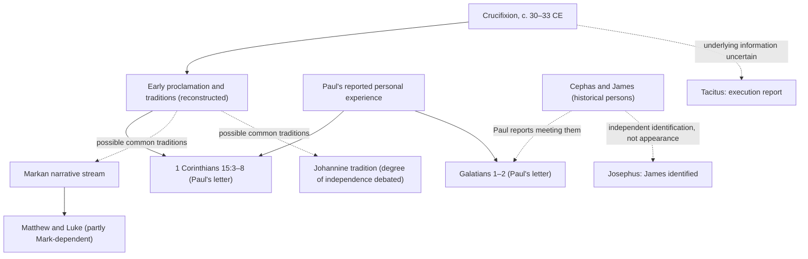

# Evidence-Provenance DAG and Paired Model Test v0.1

WP-OX-RES-0001 | 2026-10-08

## Purpose

Compare a specified bodily-resurrection hypothesis (R) with a specified early-experience-plus-transmission hypothesis (C) without overweighting skeptical or confessional scholarship. This is a provenance audit, not a posterior-probability calculation.

## Provenance graph (directed edges denote information flow, not verified historical contact)

Dotted edges are possible/limited relationships. This graph deliberately does **not** draw an eyewitness-deposition edge from Cephas, James or 500 individuals to Paul: the texts do not preserve their own accounts. Gospel independence must be evaluated per passage.

## Models with predictive commitments

**R (bodily resurrection):** Jesus died, was bodily raised in a transformed mode, and genuinely appeared to at least some named recipients. R predicts early resurrection proclamation, some sincere encounter testimony, and a concept of bodily rather than mere ghostly survival. R **does not**, without auxiliary assumptions, predict every later narrative detail, a particular appearance sequence, or how many records survive.

**C (early experience plus transmission):** Jesus died; at least Paul sincerely interpreted an experience as a risen-Jesus encounter; some early followers likewise reported experiences or inherited reports; community interpretation and subsequent transmission produced the preserved list and later narrative forms. C allows visions, religious experiences and tradition formation, but must specify who experienced what and why a *bodily* resurrection interpretation developed. C does not assume fabrication. It cannot use unspecified mechanisms to explain every inconvenient detail at no cost.

## Controlled comparison

| Observed record | R: expectation | C: expectation | Present discriminator |
|---|---|---|---|
| Paul's personal claim, 1 Cor 15:8 | Expected if he experienced an appearance | Expected if he sincerely interpreted a religious experience | Low: sincerity/report alone insufficient |
| Received formula, 1 Cor 15:3–5 | Expected | Expected if early community believed resurrection | Low: both predict early proclamation |
| Appearance list including groups, 15:6–7 | Compatible; direct shared encounter possible | Compatible, but group-report formation mechanism must be specified | Potentially high if independent firsthand group evidence is established |
| Paul's contact with Cephas/James, Gal 1 | Compatible | Compatible | Low without evidence of specific verification conversations |
| Bodily resurrection semantics, 1 Cor 15 | Strongly expected | Requires account of why bodily Jewish resurrection language was adopted | Moderate conceptual discriminator, not direct event verification |
| Empty-tomb narrative in later Gospels | Compatible, possibly expected | Compatible via historical empty tomb, interpretive development, or literary transmission | Depends on independence and actual tomb evidence |
| Josephus's James reference | Expected | Expected | None for appearance causation |

**No numerical LR is defensible from this table.** Neither model has yet established comparative likelihoods for the *joint surviving record*.

## Source-critical findings and corrections

1. Ware (2014, *New Testament Studies* 60, 475–498) argues that common arguments on both sides about the pre-Pauline formula are inconclusive and proposes new evidence about the resurrection verb. His author-written popular exposition explicitly argues that Paul's resurrection concept involves the crucified body transformed. His academic article's full argument has not been inspected. Sources: https://www.cambridge.org/core/journals/new-testament-studies/article/resurrection-of-jesus-in-the-prepauline-formula-of-1-cor-1535/B98A7CB0EDE64897CAFEE83263BE6289 ; https://hc.edu/news-and-events/2016/07/15/jesuss-resurrection-according-paul-apostle/
2. Cook (2017, *New Testament Studies* 63, 56–75), in accessible full text, argues on linguistic and comparative ancient evidence that Paul could not have conceived of resurrection without assuming an empty tomb. Cook expressly distinguishes that **belief/presupposition** from demonstrating an actual empty tomb. Source: https://www.cambridge.org/core/journals/new-testament-studies/article/resurrection-in-paganism-and-the-question-of-an-empty-tomb-in-1-corinthians-15/EF4DE640BE9104A454C7847ECF899313
3. Gieniusz (2019, *The Biblical Annals* 9, 481–492) argues that ὤφθη plus dative does not itself establish factuality. This does not imply the term excludes ordinary seeing. Source: https://czasopisma.kul.pl/index.php/ba/article/view/4526
4. Loke's open-access chapter argues for the reliability of early appearance testimony and challenges late-interpolation and fabrication proposals. The publisher-hosted abstract was checked, but the complete chapter was not inspected here. Source: https://www.taylorfrancis.com/chapters/oa-mono/10.4324/9781003037255-2/earliest-christians-claimed-witnessed-resurrected-jesus-andrew-loke
5. Bell (2019) expressly studies the historicity, nature and purpose of the 1 Cor 15 appearances; institutional bibliographic abstract verified, detailed conclusions not yet checked. Source: https://nottingham-repository.worktribe.com/output/919412/the-resurrection-appearances-in-1-corinthians-15

## Symmetry tests

- R must not be rewarded simply because it explains an extraordinary report by positing the extraordinary event. Ask for discriminating observations and independent attestation.
- C must not be rewarded simply because religious experiences occur. Ask for a documented mechanism matching the particular early and group claims, including embodied resurrection semantics.
- Neither model gets a zero prior in the central comparison. Different philosophical priors should be disclosed in sensitivity analysis.
- The 500 in Paul's list are **one surviving report about a group**, not 500 independently preserved testimonies.
- James's earlier skepticism and a conversion caused by appearance are reconstructions, not firsthand statements by James.

## Next discriminating research

Construct a passage-level Gospel appearance and empty-tomb dependency graph, including Mark's shorter ending and the compositional status of Mark 16:9–20; evaluate independent attestations and possible shared tradition. Then undertake an adversarial review with a resurrection-affirming argument and a naturalistic argument quoted accurately from accessible primary scholarly works.

## Provisional conclusion

The early Pauline evidence decisively prevents treating resurrection proclamation as solely a late Gospel invention. It does not, by itself, choose between R and a sufficiently specified early-experience C. The most promising tests are whether the early evidence entails *bodily* resurrection belief (stronger support) and whether independent evidence establishes an *objective bodily event* (still contested). 
