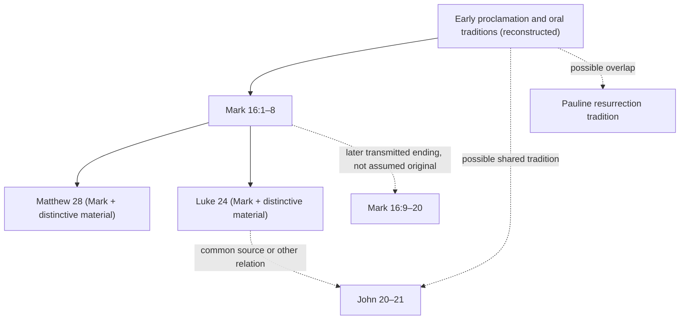

# Gospel Resurrection Narratives: Passage-Level Dependency Audit v0.1

WP-OX-RES-0001 | 2026-10-08

## Governing distinction

Four surviving Gospel narratives are **four literary witnesses**, not necessarily four causally independent eyewitness channels. Count independence by **proposition** and **transmission pathway**, not by book title. Differences may signal independent sources, authorial redaction, or both; they cannot automatically establish either.

## Passage comparison

| Proposition | Mark | Matthew | Luke | John | Provisional dependency assessment |
|---|---|---|---|---|---|
| Women visit tomb | 16:1–8 | 28:1–8 | 24:1–11 | 20:1–2 | Matthew/Luke plausibly use Mark; John has different presentation but independence of underlying event tradition unproven |
| Stone displaced / tomb found without Jesus' body | 16:4–6 | 28:2–6 | 24:2–3 | 20:1–9 | Multiple literary attestations; do not count four independent inspections |
| Angelic/heavenly messenger | 16:5–7 (young man) | 28:2–7 (angel) | 24:4–7 (two men) | 20:11–13 (two angels) | Shared core with varying characterization; source and redaction require analysis |
| Women report or react | 16:8 (fear/silence at narrative endpoint) | 28:8 | 24:9–11 | 20:2, 18 | Mark's ending does not establish that women remained silent forever |
| Jesus appears to women | Not in 16:1–8 | 28:9–10 | Not in 24:1–12 | 20:11–18 (Mary Magdalene) | Matthew and John narrate appearances; literary independence unresolved |
| Peter / disciples inspect tomb | Not in 16:1–8 | Not narrated | 24:12, 24 | 20:3–10 | Possible common tradition or other literary relation; not two independent eyewitness depositions |
| Appearance to gathered disciples | Not in 16:1–8 | 28:16–20 (Galilee) | 24:36–49 (Jerusalem) | 20:19–29 (Jerusalem) | Different locations and narrative aims; must analyze tradition and redaction |
| Bodily contact / eating | Not in 16:1–8 | 28:9 (feet grasped) | 24:39–43 (touch/eating) | 20:24–29 (Thomas episode) | Strong textual evidence of bodily interpretation in later accounts, not independent physical verification |
| Galilee emphasis | 16:7 (promised) | 28:7, 16–20 | 24 (Jerusalem-centered) | 21 (Galilee appearance) | Apparent geographic differences need source-critical analysis rather than premature harmonization or contradiction claims |

## Mark 16:9–20 textual decision

Mark 16:9–20 is **early in Christian reception**, with strong later manuscript support and a clear citation of 16:19 by Irenaeus around AD 180. Yet Codex Sinaiticus and Vaticanus omit it, additional early versions omit it, and ancient copyists sometimes noted doubts. Textual critic Elijah Hixson concludes the passage is probably not original to Mark while recommending that it remain printed with an explanatory note. This is a textual-origin judgment, **not** an assertion that the resurrection narratives were invented in the fourth century. For the **earliest recoverable Markan narrative**, use 16:1–8; separately record 16:9–20 as an early transmitted ending, not an additional independent appearance source. Source: Hixson (2020), https://www.thegospelcoalition.org/article/was-mark-16-9-20-originally-mark-gospel/

## Independence: competing scholarly arguments

**Argument for additional sources:** William Lane Craig argues that unique Matthean and Lukan material and John's narrative may preserve independent traditions. In his focused analysis of Luke 24:12,24 and John 20:1–10, Craig considers direct literary dependence and a shared earlier tradition, favoring the latter. Importantly, a **shared earlier tradition** is not two independent confirmations of an event. Sources: https://www.reasonablefaith.org/writings/question-answer/independent-sources-of-the-empty-tomb/ ; https://www.reasonablefaith.org/writings/scholarly-writings/historical-jesus/the-disciples-inspection-of-the-empty-tomb/

**Argument for stronger dependency controls:** The *Themelios* article 'Finessing Independent Attestation: A Study in Interdisciplinary Biblical Criticism' warns that literary independence is not the same as independent causal access to the facts. Even if Paul and Mark are separate documents, both could inherit a common apostolic proclamation. This is a **methodological challenge**, not evidence that a shared proclamation was false. Source: https://www.thegospelcoalition.org/themelios/article/finessing-independent-attestation-interdisciplinary-biblical-criticism/

**Synoptic literary relations:** Daniel B. Wallace's introductory treatment describes strong reasons for literary interdependence among Matthew, Mark and Luke; precise literary relations remain contested. Source: https://bible.org/article/synoptic-problem

## Evidence provenance sketch

Edges are models to test, not established author-to-author contact for every passage.

## Discriminating implications

1. **Strong:** The earliest recoverable Markan ending already narrates an empty tomb and an announcement that Jesus has been raised. A theory that locates the entire empty-tomb claim solely in late second-century invention fails this source test.
2. **Moderate:** Matthew, Luke and John show that bodily appearance traditions circulated in multiple textual forms by their respective compositions. Their *historical independence* remains to be demonstrated.
3. **Limited:** Luke/John inspection parallels might reflect a shared source; even if so, two literary accounts do not amount to two preserved first-person depositions.
4. **Undetermined:** Whether the tomb was actually empty, who inspected it, and whether bodily encounters occurred cannot be decided by document counting alone.

## Next work

- Produce a pericope-by-pericope redaction table for Matthew 28, Luke 24, John 20–21 against Mark 16:1–8, highlighting shared wording and distinctive narrative material.
- Examine whether an early pre-Markan passion narrative is independently established or merely inferred.
- Evaluate Craig's argument for separate traditions alongside the strongest dependence critiques, including whether variations exceed what editorial changes predict.
- Re-run the R-versus-C model comparison with dependency-adjusted evidentiary units and explicitly mark unresolved textual and historical uncertainties.

## Bibliography and inspection limits

Hixson, E. (2020), 'Was Mark 16:9–20 Originally Part of Mark’s Gospel?', *The Gospel Coalition*, full article inspected.
Craig, W.L., 'The Disciples’ Inspection of the Empty Tomb', author-hosted full article inspected.
'Finessing Independent Attestation', *Themelios*, search extract inspected; direct page retrieval restricted, so exact author/page citation not yet established.
Winger, J.M. (1994), 'When Did the Women Visit the Tomb?', *New Testament Studies* 40(2), 284–288, publisher preview consulted: https://www.cambridge.org/core/journals/new-testament-studies/article/abs/when-did-the-women-visit-the-tombsources-for-some-temporal-clauses-in-the-synoptic-gospels/7787CA77464230D8D5DAEC87794FCB11

No numerical likelihoods are inferred from this source comparison.
