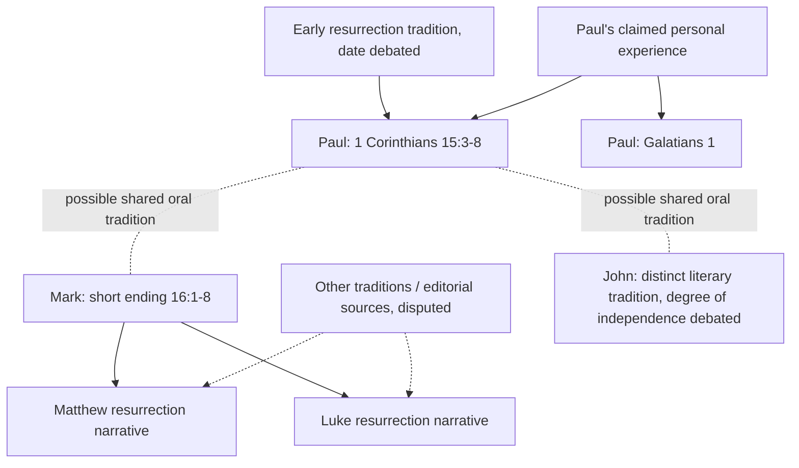

# Source-dependency and extraordinary-event comparator analysis (v0.1)

Date: 2026-10-08. Research status: provisional dependency hypotheses, direct ancient-text comparators.

## Dependency map

**Graph caveat:** Arrows represent conventional literary-dependence hypotheses or authorial report relationships, **not** demonstrated chains of eyewitness access. The relationship between Paul's early proclamation and later Gospel traditions cannot be assumed independent. Markan priority and Matthew/Luke use of Mark are widespread scholarly positions, but their scope and competing source hypotheses remain contested. John may preserve distinct traditions without being wholly independent. The longer ending of Mark 16:9-20 is text-critically disputed and should not be counted as an early independent appearance source.

### Testable source clusters

1. **Pauline firsthand claim:** 1 Corinthians 15:8-9; Galatians 1:11-24. Strong direct evidence of what Paul asserted; not direct independent verification of the encounter.
2. **Received appearance formula:** 1 Corinthians 15:3-7. A single preserved reporting stream listing several persons/groups. Its original source(s) and formation date need analysis.
3. **Synoptic narrative cluster:** Mark, Matthew, Luke. Literary dependence means three books cannot be scored as three fully independent resurrection witnesses.
4. **Johannine narrative:** John 20-21. Investigate distinct tradition and possible shared oral or literary relationships; independence cannot be assumed.
5. **External historical anchors:** Josephus, Tacitus. Relevant to persons, execution, and movement; neither directly corroborates bodily resurrection.

## Extraordinary-event comparators

### CMP-01: Romulus

**Primary ancient literary source:** Plutarch, *Life of Romulus* 27-28 (modern translation by Bernadotte Perrin): https://www.perseus.tufts.edu/hopper/text?doc=Perseus%3Atext%3A2008.01.0061%3Achapter%3D28

**Reported proposition:** Julius Proculus solemnly declared that Romulus appeared to him after disappearing, with an explanation of his return to heaven. Plutarch also records competing allegations that Romulus was murdered.

**Evidentiary unit:** Plutarch's literary report about a claimed witness, **not** Proculus's extant testimony. The source is separated from the purported event by a very long interval. It is a thematic comparator for disappearance, postmortem appearance and divine exaltation, but not a documented bodily resurrection after an independently established execution.

**Verification:** HIGH for the content of the surviving primary literary source, not for the claimed appearance.

### CMP-04: Apollonius of Tyana

**Primary ancient literary source:** Philostratus, *Life of Apollonius* 8.29-31, F. C. Conybeare translation (1912): https://www.livius.org/sources/content/philostratus-life-of-apollonius/philostratus-life-of-apollonius-8.26-31/

**Reported proposition:** Philostratus recounts competing traditions about Apollonius's end, including a miraculous departure/ascension story, and an episode in which a young skeptic, partially asleep, alone perceives Apollonius communicating about immortality. Others present cannot see him.

**Evidentiary unit:** One much later literary account describing a reported experience, with no extant firsthand testimony from the youth. Philostratus explicitly states that the purported memoirs of Damis end before his account of Apollonius's death, which matters for source dependence. The experience is described as occurring in a sleep-related state and therefore should not be conflated with a claim of publicly observed bodily resurrection.

**Verification:** HIGH for text content; event occurrence unverified.

## Initial comparative judgments

- Ancient postmortem appearances and divine ascension stories are demonstrably **not unique** to Christianity. Both Romulus and Apollonius supply comparators.
- Paul's surviving firsthand *claim of experience* differs from Plutarch's and Philostratus's later reports of others' experiences. This is a real documentary distinction, but it does not by itself prove the objective resurrection.
- The exact **joint profile** of early Pauline report, named appearance recipients, crucifixion setting, and later Gospel narratives remains a candidate for historical distinctiveness. No uniqueness claim is established without a defined reference class and systematic sampling.
- A source count must use dependency-adjusted attestation streams rather than manuscript copies, literary works, or persons merely listed as witnesses.

## Next validation tasks

1. Obtain critical scholarship with page-specific arguments on Markan priority, Johannine independence, and 1 Corinthians 15 tradition dating.
2. Construct a claim-by-source matrix distinguishing direct testimony, reported testimony, and later interpretation.
3. Compare Romulus and Apollonius with at least one *closer* restoration-to-life account, including chronological and literary-source controls.
4. Build a Bayesian model with priors expressed as scenarios and joint likelihoods corrected for dependence, without fabricated estimates.
